```python
import pandas as pd
import missingno as msno
import matplotlib.pyplot as plt
import seaborn as sns
```

Data Source: https://www.kaggle.com/c/house-prices-advanced-regression-techniques/data?select=train.csv


```python
df = pd.read_csv('../Datasets/housing_train.csv')
```


```python
df.head()
```


<div>
<style scoped>
    .dataframe tbody tr th:only-of-type {
        vertical-align: middle;
    }

    .dataframe tbody tr th {
        vertical-align: top;
    }

    .dataframe thead th {
        text-align: right;
    }
</style>
<table border="1" class="dataframe">
  <thead>
    <tr style="text-align: right;">
      <th></th>
      <th>Id</th>
      <th>MSSubClass</th>
      <th>MSZoning</th>
      <th>LotFrontage</th>
      <th>LotArea</th>
      <th>Street</th>
      <th>Alley</th>
      <th>LotShape</th>
      <th>LandContour</th>
      <th>Utilities</th>
      <th>...</th>
      <th>PoolArea</th>
      <th>PoolQC</th>
      <th>Fence</th>
      <th>MiscFeature</th>
      <th>MiscVal</th>
      <th>MoSold</th>
      <th>YrSold</th>
      <th>SaleType</th>
      <th>SaleCondition</th>
      <th>SalePrice</th>
    </tr>
  </thead>
  <tbody>
    <tr>
      <th>0</th>
      <td>1</td>
      <td>60</td>
      <td>RL</td>
      <td>65.0</td>
      <td>8450</td>
      <td>Pave</td>
      <td>NaN</td>
      <td>Reg</td>
      <td>Lvl</td>
      <td>AllPub</td>
      <td>...</td>
      <td>0</td>
      <td>NaN</td>
      <td>NaN</td>
      <td>NaN</td>
      <td>0</td>
      <td>2</td>
      <td>2008</td>
      <td>WD</td>
      <td>Normal</td>
      <td>208500</td>
    </tr>
    <tr>
      <th>1</th>
      <td>2</td>
      <td>20</td>
      <td>RL</td>
      <td>80.0</td>
      <td>9600</td>
      <td>Pave</td>
      <td>NaN</td>
      <td>Reg</td>
      <td>Lvl</td>
      <td>AllPub</td>
      <td>...</td>
      <td>0</td>
      <td>NaN</td>
      <td>NaN</td>
      <td>NaN</td>
      <td>0</td>
      <td>5</td>
      <td>2007</td>
      <td>WD</td>
      <td>Normal</td>
      <td>181500</td>
    </tr>
    <tr>
      <th>2</th>
      <td>3</td>
      <td>60</td>
      <td>RL</td>
      <td>68.0</td>
      <td>11250</td>
      <td>Pave</td>
      <td>NaN</td>
      <td>IR1</td>
      <td>Lvl</td>
      <td>AllPub</td>
      <td>...</td>
      <td>0</td>
      <td>NaN</td>
      <td>NaN</td>
      <td>NaN</td>
      <td>0</td>
      <td>9</td>
      <td>2008</td>
      <td>WD</td>
      <td>Normal</td>
      <td>223500</td>
    </tr>
    <tr>
      <th>3</th>
      <td>4</td>
      <td>70</td>
      <td>RL</td>
      <td>60.0</td>
      <td>9550</td>
      <td>Pave</td>
      <td>NaN</td>
      <td>IR1</td>
      <td>Lvl</td>
      <td>AllPub</td>
      <td>...</td>
      <td>0</td>
      <td>NaN</td>
      <td>NaN</td>
      <td>NaN</td>
      <td>0</td>
      <td>2</td>
      <td>2006</td>
      <td>WD</td>
      <td>Abnorml</td>
      <td>140000</td>
    </tr>
    <tr>
      <th>4</th>
      <td>5</td>
      <td>60</td>
      <td>RL</td>
      <td>84.0</td>
      <td>14260</td>
      <td>Pave</td>
      <td>NaN</td>
      <td>IR1</td>
      <td>Lvl</td>
      <td>AllPub</td>
      <td>...</td>
      <td>0</td>
      <td>NaN</td>
      <td>NaN</td>
      <td>NaN</td>
      <td>0</td>
      <td>12</td>
      <td>2008</td>
      <td>WD</td>
      <td>Normal</td>
      <td>250000</td>
    </tr>
  </tbody>
</table>
<p>5 rows × 81 columns</p>
</div>


```python
df.describe()
```


<div>
<style scoped>
    .dataframe tbody tr th:only-of-type {
        vertical-align: middle;
    }

    .dataframe tbody tr th {
        vertical-align: top;
    }

    .dataframe thead th {
        text-align: right;
    }
</style>
<table border="1" class="dataframe">
  <thead>
    <tr style="text-align: right;">
      <th></th>
      <th>Id</th>
      <th>MSSubClass</th>
      <th>LotFrontage</th>
      <th>LotArea</th>
      <th>OverallQual</th>
      <th>OverallCond</th>
      <th>YearBuilt</th>
      <th>YearRemodAdd</th>
      <th>MasVnrArea</th>
      <th>BsmtFinSF1</th>
      <th>...</th>
      <th>WoodDeckSF</th>
      <th>OpenPorchSF</th>
      <th>EnclosedPorch</th>
      <th>3SsnPorch</th>
      <th>ScreenPorch</th>
      <th>PoolArea</th>
      <th>MiscVal</th>
      <th>MoSold</th>
      <th>YrSold</th>
      <th>SalePrice</th>
    </tr>
  </thead>
  <tbody>
    <tr>
      <th>count</th>
      <td>1460.000000</td>
      <td>1460.000000</td>
      <td>1201.000000</td>
      <td>1460.000000</td>
      <td>1460.000000</td>
      <td>1460.000000</td>
      <td>1460.000000</td>
      <td>1460.000000</td>
      <td>1452.000000</td>
      <td>1460.000000</td>
      <td>...</td>
      <td>1460.000000</td>
      <td>1460.000000</td>
      <td>1460.000000</td>
      <td>1460.000000</td>
      <td>1460.000000</td>
      <td>1460.000000</td>
      <td>1460.000000</td>
      <td>1460.000000</td>
      <td>1460.000000</td>
      <td>1460.000000</td>
    </tr>
    <tr>
      <th>mean</th>
      <td>730.500000</td>
      <td>56.897260</td>
      <td>70.049958</td>
      <td>10516.828082</td>
      <td>6.099315</td>
      <td>5.575342</td>
      <td>1971.267808</td>
      <td>1984.865753</td>
      <td>103.685262</td>
      <td>443.639726</td>
      <td>...</td>
      <td>94.244521</td>
      <td>46.660274</td>
      <td>21.954110</td>
      <td>3.409589</td>
      <td>15.060959</td>
      <td>2.758904</td>
      <td>43.489041</td>
      <td>6.321918</td>
      <td>2007.815753</td>
      <td>180921.195890</td>
    </tr>
    <tr>
      <th>std</th>
      <td>421.610009</td>
      <td>42.300571</td>
      <td>24.284752</td>
      <td>9981.264932</td>
      <td>1.382997</td>
      <td>1.112799</td>
      <td>30.202904</td>
      <td>20.645407</td>
      <td>181.066207</td>
      <td>456.098091</td>
      <td>...</td>
      <td>125.338794</td>
      <td>66.256028</td>
      <td>61.119149</td>
      <td>29.317331</td>
      <td>55.757415</td>
      <td>40.177307</td>
      <td>496.123024</td>
      <td>2.703626</td>
      <td>1.328095</td>
      <td>79442.502883</td>
    </tr>
    <tr>
      <th>min</th>
      <td>1.000000</td>
      <td>20.000000</td>
      <td>21.000000</td>
      <td>1300.000000</td>
      <td>1.000000</td>
      <td>1.000000</td>
      <td>1872.000000</td>
      <td>1950.000000</td>
      <td>0.000000</td>
      <td>0.000000</td>
      <td>...</td>
      <td>0.000000</td>
      <td>0.000000</td>
      <td>0.000000</td>
      <td>0.000000</td>
      <td>0.000000</td>
      <td>0.000000</td>
      <td>0.000000</td>
      <td>1.000000</td>
      <td>2006.000000</td>
      <td>34900.000000</td>
    </tr>
    <tr>
      <th>25%</th>
      <td>365.750000</td>
      <td>20.000000</td>
      <td>59.000000</td>
      <td>7553.500000</td>
      <td>5.000000</td>
      <td>5.000000</td>
      <td>1954.000000</td>
      <td>1967.000000</td>
      <td>0.000000</td>
      <td>0.000000</td>
      <td>...</td>
      <td>0.000000</td>
      <td>0.000000</td>
      <td>0.000000</td>
      <td>0.000000</td>
      <td>0.000000</td>
      <td>0.000000</td>
      <td>0.000000</td>
      <td>5.000000</td>
      <td>2007.000000</td>
      <td>129975.000000</td>
    </tr>
    <tr>
      <th>50%</th>
      <td>730.500000</td>
      <td>50.000000</td>
      <td>69.000000</td>
      <td>9478.500000</td>
      <td>6.000000</td>
      <td>5.000000</td>
      <td>1973.000000</td>
      <td>1994.000000</td>
      <td>0.000000</td>
      <td>383.500000</td>
      <td>...</td>
      <td>0.000000</td>
      <td>25.000000</td>
      <td>0.000000</td>
      <td>0.000000</td>
      <td>0.000000</td>
      <td>0.000000</td>
      <td>0.000000</td>
      <td>6.000000</td>
      <td>2008.000000</td>
      <td>163000.000000</td>
    </tr>
    <tr>
      <th>75%</th>
      <td>1095.250000</td>
      <td>70.000000</td>
      <td>80.000000</td>
      <td>11601.500000</td>
      <td>7.000000</td>
      <td>6.000000</td>
      <td>2000.000000</td>
      <td>2004.000000</td>
      <td>166.000000</td>
      <td>712.250000</td>
      <td>...</td>
      <td>168.000000</td>
      <td>68.000000</td>
      <td>0.000000</td>
      <td>0.000000</td>
      <td>0.000000</td>
      <td>0.000000</td>
      <td>0.000000</td>
      <td>8.000000</td>
      <td>2009.000000</td>
      <td>214000.000000</td>
    </tr>
    <tr>
      <th>max</th>
      <td>1460.000000</td>
      <td>190.000000</td>
      <td>313.000000</td>
      <td>215245.000000</td>
      <td>10.000000</td>
      <td>9.000000</td>
      <td>2010.000000</td>
      <td>2010.000000</td>
      <td>1600.000000</td>
      <td>5644.000000</td>
      <td>...</td>
      <td>857.000000</td>
      <td>547.000000</td>
      <td>552.000000</td>
      <td>508.000000</td>
      <td>480.000000</td>
      <td>738.000000</td>
      <td>15500.000000</td>
      <td>12.000000</td>
      <td>2010.000000</td>
      <td>755000.000000</td>
    </tr>
  </tbody>
</table>
<p>8 rows × 38 columns</p>
</div>


```python
df.info()
```

    <class 'pandas.core.frame.DataFrame'>
    RangeIndex: 1460 entries, 0 to 1459
    Data columns (total 81 columns):
     #   Column         Non-Null Count  Dtype  
    ---  ------         --------------  -----  
     0   Id             1460 non-null   int64  
     1   MSSubClass     1460 non-null   int64  
     2   MSZoning       1460 non-null   object 
     3   LotFrontage    1201 non-null   float64
     4   LotArea        1460 non-null   int64  
     5   Street         1460 non-null   object 
     6   Alley          91 non-null     object 
     7   LotShape       1460 non-null   object 
     8   LandContour    1460 non-null   object 
     9   Utilities      1460 non-null   object 
     10  LotConfig      1460 non-null   object 
     11  LandSlope      1460 non-null   object 
     12  Neighborhood   1460 non-null   object 
     13  Condition1     1460 non-null   object 
     14  Condition2     1460 non-null   object 
     15  BldgType       1460 non-null   object 
     16  HouseStyle     1460 non-null   object 
     17  OverallQual    1460 non-null   int64  
     18  OverallCond    1460 non-null   int64  
     19  YearBuilt      1460 non-null   int64  
     20  YearRemodAdd   1460 non-null   int64  
     21  RoofStyle      1460 non-null   object 
     22  RoofMatl       1460 non-null   object 
     23  Exterior1st    1460 non-null   object 
     24  Exterior2nd    1460 non-null   object 
     25  MasVnrType     1452 non-null   object 
     26  MasVnrArea     1452 non-null   float64
     27  ExterQual      1460 non-null   object 
     28  ExterCond      1460 non-null   object 
     29  Foundation     1460 non-null   object 
     30  BsmtQual       1423 non-null   object 
     31  BsmtCond       1423 non-null   object 
     32  BsmtExposure   1422 non-null   object 
     33  BsmtFinType1   1423 non-null   object 
     34  BsmtFinSF1     1460 non-null   int64  
     35  BsmtFinType2   1422 non-null   object 
     36  BsmtFinSF2     1460 non-null   int64  
     37  BsmtUnfSF      1460 non-null   int64  
     38  TotalBsmtSF    1460 non-null   int64  
     39  Heating        1460 non-null   object 
     40  HeatingQC      1460 non-null   object 
     41  CentralAir     1460 non-null   object 
     42  Electrical     1459 non-null   object 
     43  1stFlrSF       1460 non-null   int64  
     44  2ndFlrSF       1460 non-null   int64  
     45  LowQualFinSF   1460 non-null   int64  
     46  GrLivArea      1460 non-null   int64  
     47  BsmtFullBath   1460 non-null   int64  
     48  BsmtHalfBath   1460 non-null   int64  
     49  FullBath       1460 non-null   int64  
     50  HalfBath       1460 non-null   int64  
     51  BedroomAbvGr   1460 non-null   int64  
     52  KitchenAbvGr   1460 non-null   int64  
     53  KitchenQual    1460 non-null   object 
     54  TotRmsAbvGrd   1460 non-null   int64  
     55  Functional     1460 non-null   object 
     56  Fireplaces     1460 non-null   int64  
     57  FireplaceQu    770 non-null    object 
     58  GarageType     1379 non-null   object 
     59  GarageYrBlt    1379 non-null   float64
     60  GarageFinish   1379 non-null   object 
     61  GarageCars     1460 non-null   int64  
     62  GarageArea     1460 non-null   int64  
     63  GarageQual     1379 non-null   object 
     64  GarageCond     1379 non-null   object 
     65  PavedDrive     1460 non-null   object 
     66  WoodDeckSF     1460 non-null   int64  
     67  OpenPorchSF    1460 non-null   int64  
     68  EnclosedPorch  1460 non-null   int64  
     69  3SsnPorch      1460 non-null   int64  
     70  ScreenPorch    1460 non-null   int64  
     71  PoolArea       1460 non-null   int64  
     72  PoolQC         7 non-null      object 
     73  Fence          281 non-null    object 
     74  MiscFeature    54 non-null     object 
     75  MiscVal        1460 non-null   int64  
     76  MoSold         1460 non-null   int64  
     77  YrSold         1460 non-null   int64  
     78  SaleType       1460 non-null   object 
     79  SaleCondition  1460 non-null   object 
     80  SalePrice      1460 non-null   int64  
    dtypes: float64(3), int64(35), object(43)
    memory usage: 924.0+ KB
    

# Columns


```python
df.dtypes
```


    Id                 int64
    MSSubClass         int64
    MSZoning          object
    LotFrontage      float64
    LotArea            int64
                      ...   
    MoSold             int64
    YrSold             int64
    SaleType          object
    SaleCondition     object
    SalePrice          int64
    Length: 81, dtype: object


```python
numerical_cols = [cname for cname in df.columns if df[cname].dtype in ['int64', 'float64']]
print('Number of numerical columns: ', len(numerical_cols))
# numerical_cols
```

    Number of numerical columns:  38
    


```python
categorical_columns = [cname for cname in df.columns if df[cname].dtype=='object']
print('Number of categorical columns: ', len(categorical_columns))
# categorical_columns
```

    Number of categorical columns:  43
    

# Missing Value Analysis


```python
msno.matrix(df)
```


    <matplotlib.axes._subplots.AxesSubplot at 0x1910bef8760>


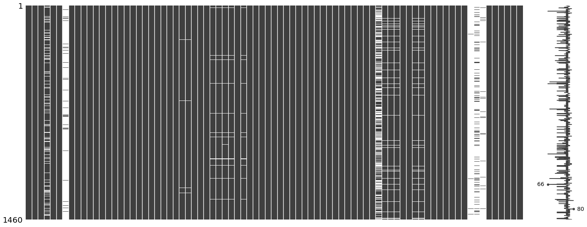


```python
cols_with_missing = [col for col in df.columns if df[col].isnull().any()]
print('Columns with missing values in df: ', cols_with_missing)
```

    Columns with missing values in df:  ['LotFrontage', 'Alley', 'MasVnrType', 'MasVnrArea', 'BsmtQual', 'BsmtCond', 'BsmtExposure', 'BsmtFinType1', 'BsmtFinType2', 'Electrical', 'FireplaceQu', 'GarageType', 'GarageYrBlt', 'GarageFinish', 'GarageQual', 'GarageCond', 'PoolQC', 'Fence', 'MiscFeature']
    

## Handling Missing Values

### 1. Omit Data

We filter out columns which contain more than 90% missing values.


```python
nv1 = df.isnull().sum()
nv2 = nv1.where(nv1>0).dropna()/df.shape[0]*100
nv2.where(nv>90).dropna()
```


    Alley          93.767123
    PoolQC         99.520548
    MiscFeature    96.301370
    dtype: float64


We see here PoolQC contains 99% missing values and we decide to go ahead and drop it.


```python
cols_to_drop = ['PoolQC']

X = df.drop(cols_to_drop, axis=1)

if 'PoolQC' in X.columns:
    print('Drop Failed')
else:
    print('Drop Passed')
```

    Drop Passed
    

### 2. Imputation

```python
from sklearn.compose import ColumnTransformer
from sklearn.pipeline import Pipeline
from sklearn.impute import SimpleImputer
from sklearn.preprocessing import OneHotEncoder
```

```python
# Preprocessing for numerical data
numerical_transformer = SimpleImputer(strategy='median')

# Preprocessing for categorical data
categorical_transformer = Pipeline(steps=[
    ('imputer', SimpleImputer(strategy='most_frequent')),
    ('onehot', OneHotEncoder(handle_unknown='ignore'))
])
```

```python
# Bundle preprocessing for numerical and categorical data
preprocessor = ColumnTransformer(
    transformers=[
        ('num', numerical_transformer, numerical_cols),
        ('cat', categorical_transformer, categorical_columns)
    ])
```

Additional Notes on how to use these objects:

```python
linear_reg_pipe = Pipeline(steps=[('preprocessor', preprocessor),('regressor', LinearRegression())])
```

```python
linear_reg_pipe.fit(X_train, y_train)
linear_reg_preds = linear_reg_pipe.predict(X_test)
```

# Unique Values 


```python
df[numerical_cols].nunique()
```


    Id               1460
    MSSubClass         15
    LotFrontage       110
    LotArea          1073
    OverallQual        10
    OverallCond         9
    YearBuilt         112
    YearRemodAdd       61
    MasVnrArea        327
    BsmtFinSF1        637
    BsmtFinSF2        144
    BsmtUnfSF         780
    TotalBsmtSF       721
    1stFlrSF          753
    2ndFlrSF          417
    LowQualFinSF       24
    GrLivArea         861
    BsmtFullBath        4
    BsmtHalfBath        3
    FullBath            4
    HalfBath            3
    BedroomAbvGr        8
    KitchenAbvGr        4
    TotRmsAbvGrd       12
    Fireplaces          4
    GarageYrBlt        97
    GarageCars          5
    GarageArea        441
    WoodDeckSF        274
    OpenPorchSF       202
    EnclosedPorch     120
    3SsnPorch          20
    ScreenPorch        76
    PoolArea            8
    MiscVal            21
    MoSold             12
    YrSold              5
    SalePrice         663
    dtype: int64


```python
df[categorical_columns].nunique()
```


    MSZoning          5
    Street            2
    Alley             2
    LotShape          4
    LandContour       4
    Utilities         2
    LotConfig         5
    LandSlope         3
    Neighborhood     25
    Condition1        9
    Condition2        8
    BldgType          5
    HouseStyle        8
    RoofStyle         6
    RoofMatl          8
    Exterior1st      15
    Exterior2nd      16
    MasVnrType        4
    ExterQual         4
    ExterCond         5
    Foundation        6
    BsmtQual          4
    BsmtCond          4
    BsmtExposure      4
    BsmtFinType1      6
    BsmtFinType2      6
    Heating           6
    HeatingQC         5
    CentralAir        2
    Electrical        5
    KitchenQual       4
    Functional        7
    FireplaceQu       5
    GarageType        6
    GarageFinish      3
    GarageQual        5
    GarageCond        5
    PavedDrive        3
    PoolQC            3
    Fence             4
    MiscFeature       4
    SaleType          9
    SaleCondition     6
    dtype: int64


# Visualizations

# Histogram


```python
plt.figure(figsize=(12,6))
plt.hist(df['SalePrice'])
```


    (array([148., 723., 373., 135.,  51.,  19.,   4.,   3.,   2.,   2.]),
     array([ 34900., 106910., 178920., 250930., 322940., 394950., 466960.,
            538970., 610980., 682990., 755000.]),
     <a list of 10 Patch objects>)


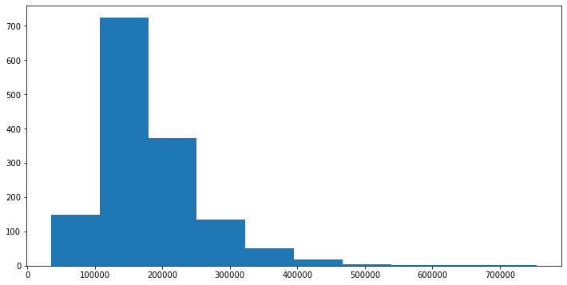


# Line Plot 


```python
plt.figure(figsize=(15,8))
sns.lineplot(data=df[:100]['SalePrice'])
```


    <matplotlib.axes._subplots.AxesSubplot at 0x1910852fd30>


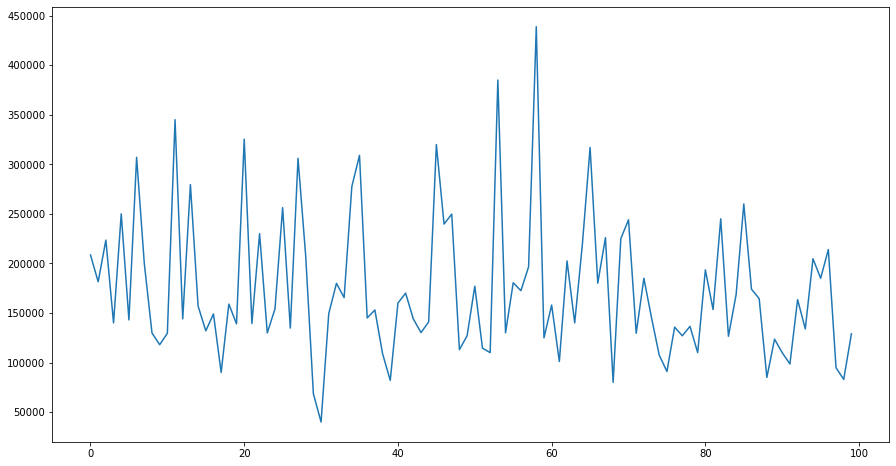


# Violin Plot


```python
plt.figure(figsize=(12,6))
sns.violinplot(x = df['SaleCondition'], y = df['SalePrice'])
plt.axhline(df[df['SaleCondition'] == 'Normal']['SalePrice'].mean(),\
            color='r',linestyle='dashed',label='normal_avg')
plt.legend()
```


    <matplotlib.legend.Legend at 0x1910b632f40>


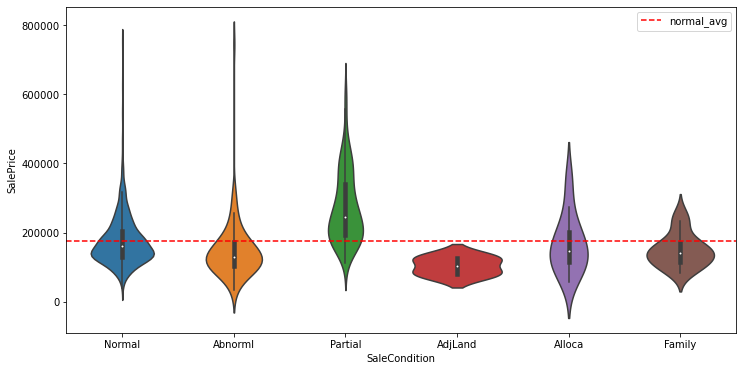


# Box Plot

 - Horizontal


```python
plt.figure(figsize=(12,6))
sns.boxplot(data=df, y='SaleCondition', x='SalePrice', orient='h')
```


    <matplotlib.axes._subplots.AxesSubplot at 0x1910dcf7250>


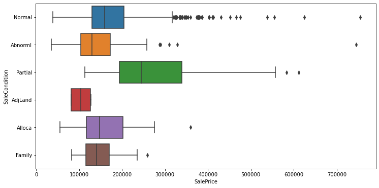


- Vertical


```python
plt.figure(figsize=(12,6))
sns.boxplot(data=df, x='SaleCondition', y='SalePrice', orient='v')
```


    <matplotlib.axes._subplots.AxesSubplot at 0x1910dcf7070>


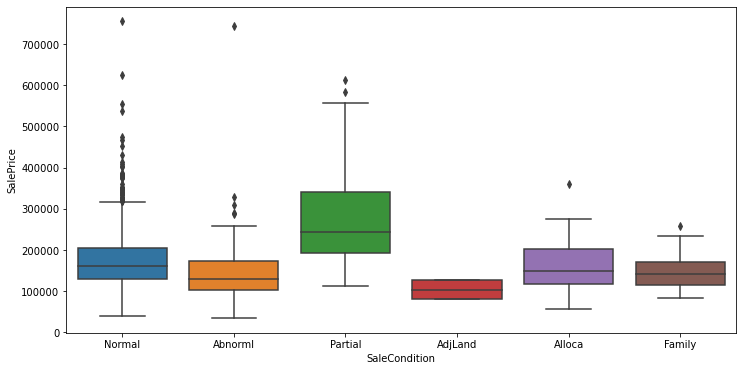


# Univariate Analysis


```python
fig, axes = plt.subplots(nrows=6, ncols=6, figsize=(30,30))
for i, col in enumerate(numerical_cols[0:-2]): 
    sns.distplot(df[col], kde=False, ax=axes[i//6,i%6])
```


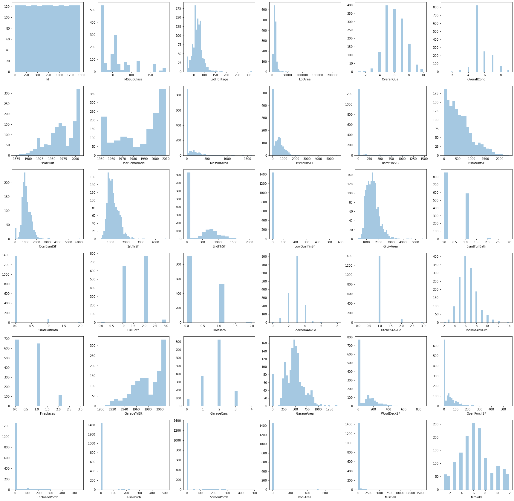


```python
fig, axes = plt.subplots(nrows=1, ncols=2, figsize=(15,5))
for i, col in enumerate(numerical_cols[36:]): 
    sns.distplot(df[col], kde=False, ax=axes[i])
```


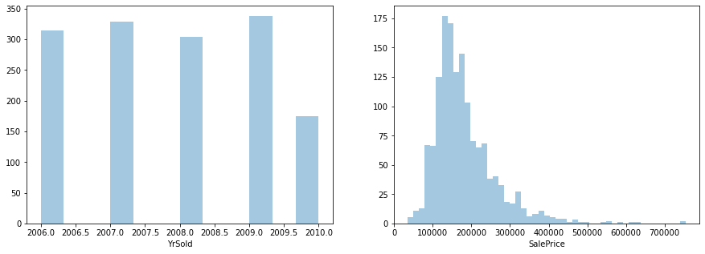


# Bivariate Distribution (Heatmap)


```python
plt.figure(figsize=(10,5))
sns.heatmap(df[numerical_cols].corr(), annot=False, cmap='coolwarm', fmt='.1f')
```


    <matplotlib.axes._subplots.AxesSubplot at 0x191101481f0>


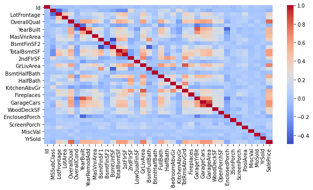


# Ridge Line Plot


```python
ridge_plot = sns.FacetGrid(df, row="SaleCondition", hue="SaleCondition", aspect=5, height=1.25)  
ridge_plot.map(sns.kdeplot, 'SalePrice', shade=True)
ridge_plot.map(plt.axhline)
ridge_plot.fig.subplots_adjust(hspace=0.35)
```


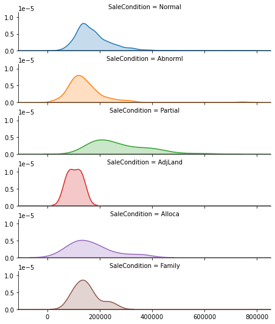


# Scatter Plots


```python
plt.figure(figsize=(10,5))
sns.scatterplot(data=df.iloc[:200,:], x='YearBuilt', y='SalePrice')
sns.lineplot([1880,2000], [0,500000])
```


    <matplotlib.axes._subplots.AxesSubplot at 0x19110619bb0>


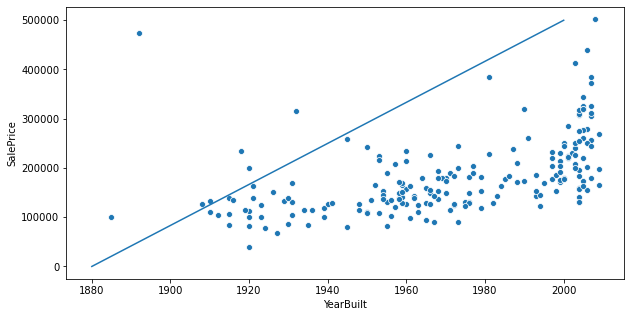


## QQ Plots


```python
from seaborn_qqplot import pplot
```


```python
pplot(df.iloc[:250,:], x='YearBuilt', y='SalePrice', kind='qq', height=4, aspect=2)
```


    <seaborn.axisgrid.PairGrid at 0x191132283d0>


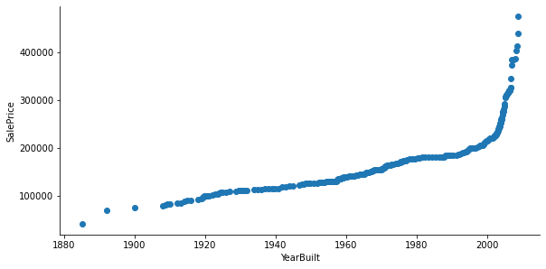


```python

```
