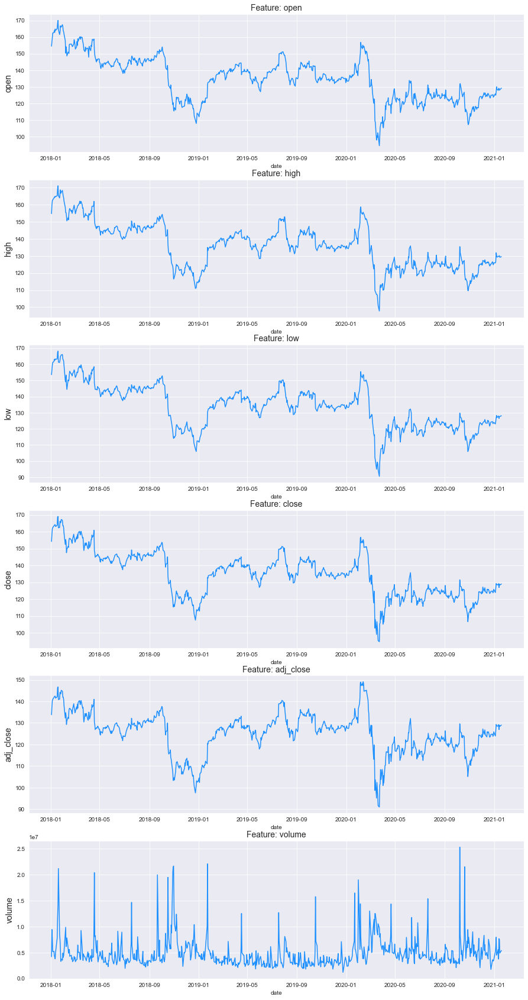
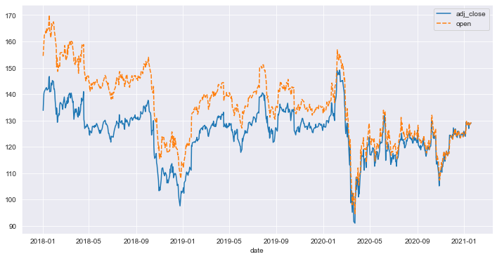
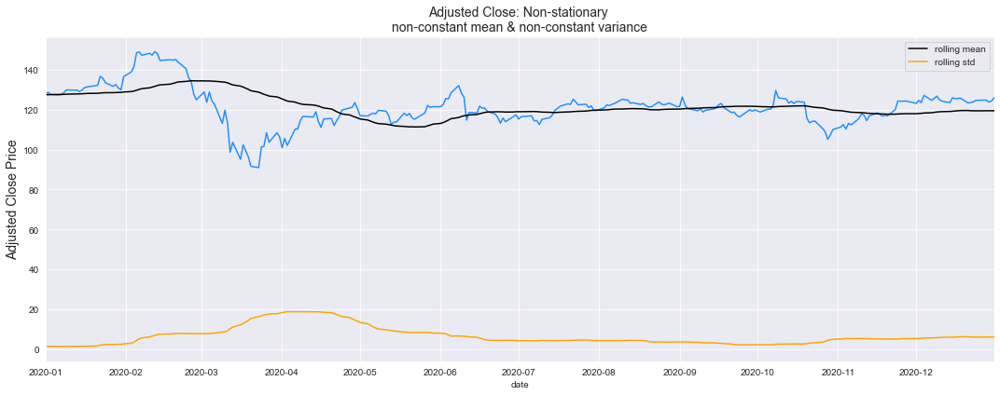
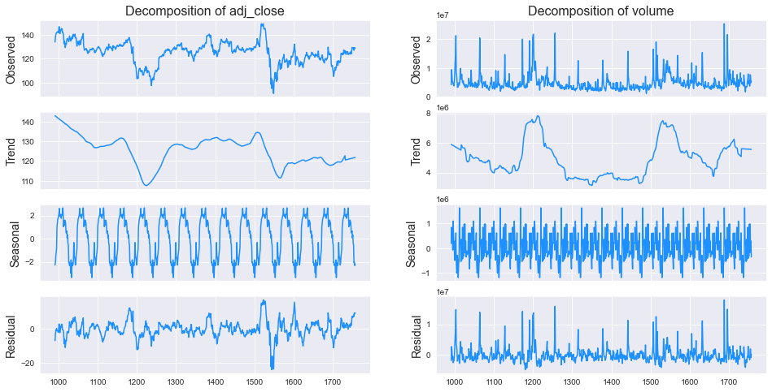
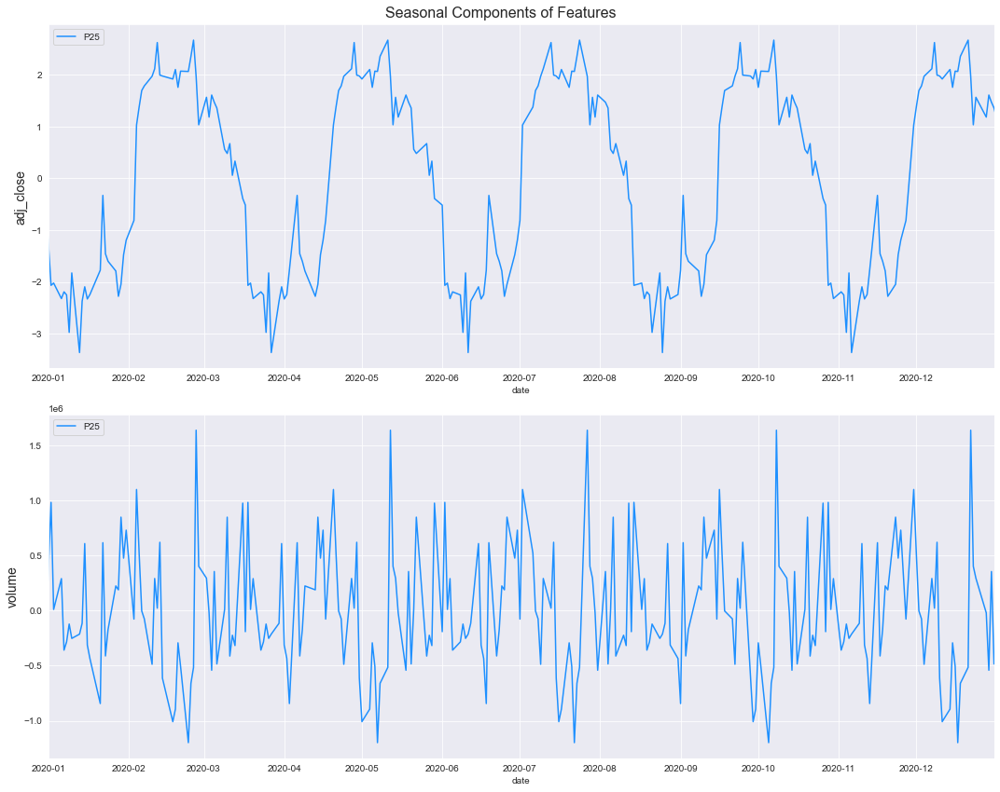

```python
import pandas as pd
import matplotlib.pyplot as plt
import seaborn as sns
import numpy as np
```


```python
%matplotlib inline
sns.set_style('darkgrid')
```

# <a id='0'>Content</a>

- <a href='#1'>About the dataset</a>  
- <a href='#2'>Line Plot</a>
- <a href='#4'>Plot Multiple time series</a>
- <a href='#3'>Seasonal and trend Components</a>
  - <a href='#31'>Visual analysis of Seasonality</a>
- <a href='#5'> Check stationarity visually using rolling mean </a>
- <a href='#7'>References</a>

## <a id='1'> About the dataset </a>

This dataset is originally from the yahoo finance website. For IBM company, 'open', 'high', 'low', 'close', 'adj_close', 'volume' data.


```python
df= pd.read_csv('../Datasets/IBM.csv',parse_dates=[0],infer_datetime_format=True)
```


```python
df.info()
```

    <class 'pandas.core.frame.DataFrame'>
    RangeIndex: 1758 entries, 0 to 1757
    Data columns (total 7 columns):
     #   Column     Non-Null Count  Dtype         
    ---  ------     --------------  -----         
     0   Date       1758 non-null   datetime64[ns]
     1   Open       1758 non-null   float64       
     2   High       1758 non-null   float64       
     3   Low        1758 non-null   float64       
     4   Close      1758 non-null   float64       
     5   Adj Close  1758 non-null   float64       
     6   Volume     1758 non-null   int64         
    dtypes: datetime64[ns](1), float64(5), int64(1)
    memory usage: 96.3 KB
    


```python
df.columns = ['date', 'open', 'high', 'low', 'close', 'adj_close', 'volume']
```


```python
df.head()
```


<div>
<style scoped>
    .dataframe tbody tr th:only-of-type {
        vertical-align: middle;
    }

    .dataframe tbody tr th {
        vertical-align: top;
    }

    .dataframe thead th {
        text-align: right;
    }
</style>
<table border="1" class="dataframe">
  <thead>
    <tr style="text-align: right;">
      <th></th>
      <th>date</th>
      <th>open</th>
      <th>high</th>
      <th>low</th>
      <th>close</th>
      <th>adj_close</th>
      <th>volume</th>
    </tr>
  </thead>
  <tbody>
    <tr>
      <th>0</th>
      <td>2014-01-27</td>
      <td>179.610001</td>
      <td>179.649994</td>
      <td>177.660004</td>
      <td>177.899994</td>
      <td>135.293381</td>
      <td>5208600</td>
    </tr>
    <tr>
      <th>1</th>
      <td>2014-01-28</td>
      <td>178.050003</td>
      <td>178.449997</td>
      <td>176.160004</td>
      <td>176.850006</td>
      <td>134.494843</td>
      <td>5333300</td>
    </tr>
    <tr>
      <th>2</th>
      <td>2014-01-29</td>
      <td>175.979996</td>
      <td>178.529999</td>
      <td>175.889999</td>
      <td>176.399994</td>
      <td>134.152634</td>
      <td>4970900</td>
    </tr>
    <tr>
      <th>3</th>
      <td>2014-01-30</td>
      <td>177.169998</td>
      <td>177.860001</td>
      <td>176.360001</td>
      <td>177.360001</td>
      <td>134.882690</td>
      <td>4853700</td>
    </tr>
    <tr>
      <th>4</th>
      <td>2014-01-31</td>
      <td>176.110001</td>
      <td>177.839996</td>
      <td>175.339996</td>
      <td>176.679993</td>
      <td>134.365555</td>
      <td>5193400</td>
    </tr>
  </tbody>
</table>
</div>


```python
df = df[df['date']> pd.to_datetime('2018-01-01', format='%Y-%m-%d')]
```


```python

```

### <a id='2'>Line Plot</a>


```python
f, ax = plt.subplots(nrows=6, ncols=1, figsize=(15, 30))

for i, col in enumerate(df.drop('date', axis=1).columns):
    sns.lineplot(x='date', y=col,data=df, ax=ax[i], color='dodgerblue')
    ax[i].set_title('Feature: {}'.format(col), fontsize=14)
    ax[i].set_ylabel(ylabel=col, fontsize=14)
```


    

    


## <a id='4'>Plot Multiple time series</a>


```python
plt.figure(figsize=(12,6))
sns.lineplot(data=df[['adj_close','open','date']].set_index('date'))
```


    <AxesSubplot:xlabel='date'>


    

    


```python

```

## <a id='5'> Check stationarity visually using rolling mean </a>


```python
# A year has 52 weeks (52 weeks * 7 days per week) aporx.
rolling_window = 52
f = plt.figure(figsize=(15, 6))
ax = plt.gca()

sns.lineplot(x=df['date'], y=df['adj_close'], color='dodgerblue')
sns.lineplot(x=df['date'], y=df['adj_close'].rolling(rolling_window).mean(),  color='black', label='rolling mean')
sns.lineplot(x=df['date'], y=df['adj_close'].rolling(rolling_window).std(), color='orange', label='rolling std')
ax.set_title('Adjusted Close: Non-stationary \nnon-constant mean & non-constant variance', fontsize=14)
ax.set_ylabel(ylabel='Adjusted Close Price', fontsize=14)
ax.set_xlim([pd.to_datetime('2020-01-01', format='%Y-%m-%d'), pd.to_datetime('2020-12-31', format='%Y-%m-%d')])

plt.tight_layout()
plt.show()
```


    

    


## <a id='3'>Seasonal and trend Components</a>


```python
from statsmodels.tsa.seasonal import seasonal_decompose

core_columns =  ['adj_close','volume']

for column in core_columns:
    decomp = seasonal_decompose(df[column], period=52, model='additive', extrapolate_trend='freq')
    df[f"{column}_trend"] = decomp.trend
    df[f"{column}_seasonal"] = decomp.seasonal
```


```python
fig, ax = plt.subplots(ncols=2, nrows=4, sharex=True, figsize=(16,8))

for i, column in enumerate(['adj_close', 'volume']):
    
    res = seasonal_decompose(df[column], freq=52, model='additive', extrapolate_trend='freq')

    ax[0,i].set_title('Decomposition of {}'.format(column), fontsize=16)
    res.observed.plot(ax=ax[0,i], legend=False, color='dodgerblue')
    ax[0,i].set_ylabel('Observed', fontsize=14)

    res.trend.plot(ax=ax[1,i], legend=False, color='dodgerblue')
    ax[1,i].set_ylabel('Trend', fontsize=14)

    res.seasonal.plot(ax=ax[2,i], legend=False, color='dodgerblue')
    ax[2,i].set_ylabel('Seasonal', fontsize=14)
    
    res.resid.plot(ax=ax[3,i], legend=False, color='dodgerblue')
    ax[3,i].set_ylabel('Residual', fontsize=14)

plt.show()
```

    c:\users\rahul agarwal\.conda\envs\tensorflow\lib\site-packages\ipykernel_launcher.py:5: FutureWarning: the 'freq'' keyword is deprecated, use 'period' instead
      """
    c:\users\rahul agarwal\.conda\envs\tensorflow\lib\site-packages\ipykernel_launcher.py:5: FutureWarning: the 'freq'' keyword is deprecated, use 'period' instead
      """
    


    

    


### <a id='31'>Visual analysis of Seasonality</a>


```python
f, ax = plt.subplots(nrows=2, ncols=1, figsize=(15, 12))
f.suptitle('Seasonal Components of Features', fontsize=16)

for i, column in enumerate(core_columns):
    sns.lineplot(x=df['date'], y=df[column + '_seasonal'], ax=ax[i], color='dodgerblue', label='P25')
    ax[i].set_ylabel(ylabel=column, fontsize=14)
    ax[i].set_xlim([pd.to_datetime('2020-01-01', format='%Y-%m-%d'), pd.to_datetime('2020-12-31', format='%Y-%m-%d')])
    
plt.tight_layout()
plt.show()
```


    

    


### <a id='7'>Refrences</a>
 - https://www.kaggle.com/andreshg/timeseries-analysis-a-complete-guide
