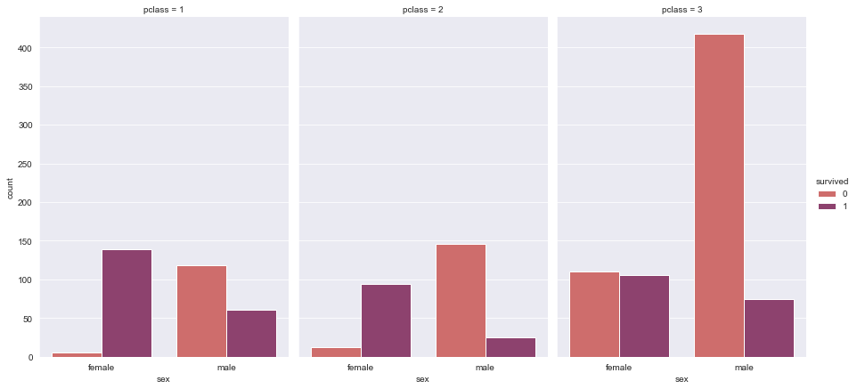
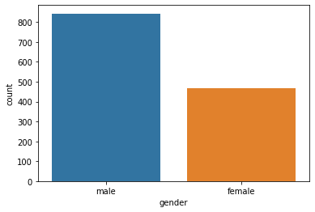
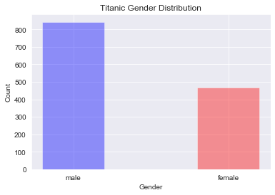
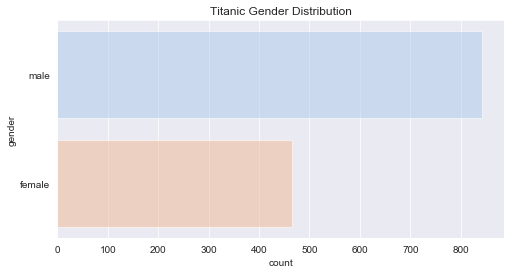
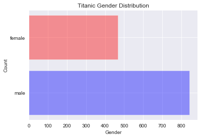
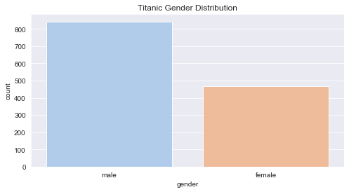

# Categorical Variables - Barcharts


```python
sns.set_style('darkgrid')
```

## Faceted Bar Chart
##### seaborn


```python
g = sns.catplot(x="sex", y="count",
                hue="survived", col="pclass",
                data=df_cop, kind="bar",
                height=6, aspect=.7, palette="flare");
```





## Basic Bar Chart


```python
df_copy2  = df['sex'].value_counts().reset_index()
df_copy2.columns = ['gender', 'count']
df = df_copy2
```

##### seaborn


```python
plt.figure(figsize=(8,4))
plt.title('Titanic Gender Distribution')

sns.barplot(x='gender', y='count', data=df, palette='pastel', alpha=0.9)

```


    <matplotlib.axes._subplots.AxesSubplot at 0x1a27b16a58>





##### matplotlib


```python
plt.title('Titanic Gender Distribution')
plt.bar(x=df['gender'], height=df['count'], color=['blue', 'red'], alpha=0.4, width=0.4)
plt.xlabel('Gender')
plt.ylabel('Count')
```


    Text(0, 0.5, 'Count')





## Horizontal Bar charts
##### seaborn


```python
# Flip the x and y variables
plt.figure(figsize=(8,4))
plt.title('Titanic Gender Distribution')
sns.barplot(x='count', y='gender', data=df, palette='pastel', alpha=0.5)
```


    <matplotlib.axes._subplots.AxesSubplot at 0x1a288852e8>





##### matplotlib


```python
# y and width are the passed params
plt.title('Titanic Gender Distribution')
plt.barh(y=df['gender'], width=df['count'], color=['blue', 'red'], alpha=0.4)
plt.xlabel('Gender')
plt.ylabel('Count')
```


    Text(0, 0.5, 'Count')





## Reordering the bars

##### seaborn


```python
# notice the order parameter
plt.figure(figsize=(8,4))
plt.title('Titanic Gender Distribution')

sns.barplot(x='gender', y='count', data=df, palette='pastel', alpha=0.9, order=['male', 'female'])

```


    <matplotlib.axes._subplots.AxesSubplot at 0x1a27b5b518>





##### matplotlib

Done by ordering the dataframe and then plotting
