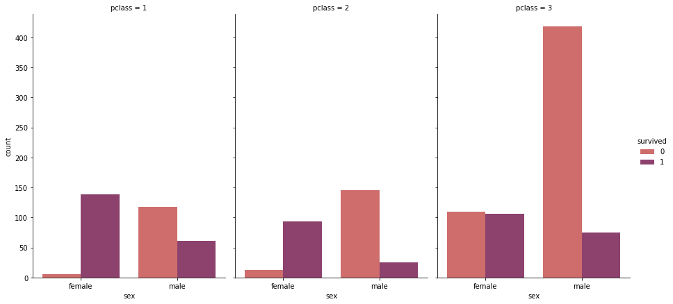
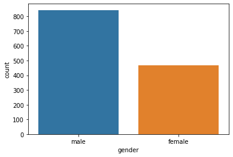
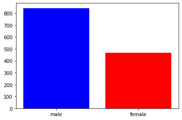
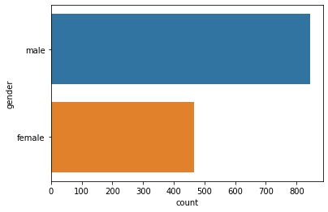
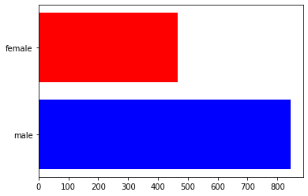
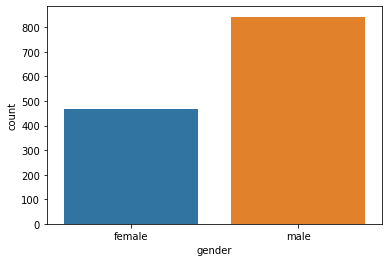

# Categorical Variables - Barcharts


## Faceted Bar Chart
##### seaborn


```python
g = sns.catplot(x="sex", y="count",
                hue="survived", col="pclass",
                data=df_cop, kind="bar",
                height=6, aspect=.7, palette="flare");
```





## Basic Bar Chart


```python
df_copy2  = df['sex'].value_counts().reset_index()
df_copy2.columns = ['gender', 'count']
```

##### seaborn


```python
sns.barplot(x='gender', y='count', data=df_copy2)
```


    <matplotlib.axes._subplots.AxesSubplot at 0x1a29526cc0>





##### matplotlib


```python
plt.bar(x=df_copy2.gender, height=df_copy2['count'], color=['blue', 'red'])
```


    <BarContainer object of 2 artists>





## Horizontal Bar charts
##### seaborn


```python
# Flip the x and y variables
sns.barplot(x='count', y='gender', data=df_copy2)
```


    <matplotlib.axes._subplots.AxesSubplot at 0x1a2599a7f0>





##### matplotlib


```python
# y and width are the passed params
plt.barh(y=df_copy2.gender, width=df_copy2['count'], color=['blue', 'red'])
```


    <BarContainer object of 2 artists>





## Reordering the bars

##### seaborn


```python
# notice the order parameter
sns.barplot(x='gender', y='count', data=df_copy2, order=['female', 'male'])
```


    <matplotlib.axes._subplots.AxesSubplot at 0x1a246b2da0>





##### matplotlib

Done by ordering the dataframe and then plotting
