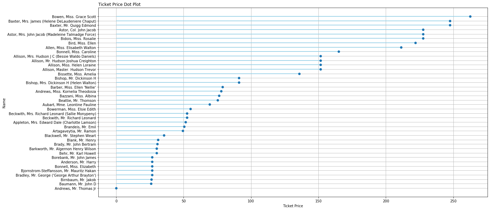
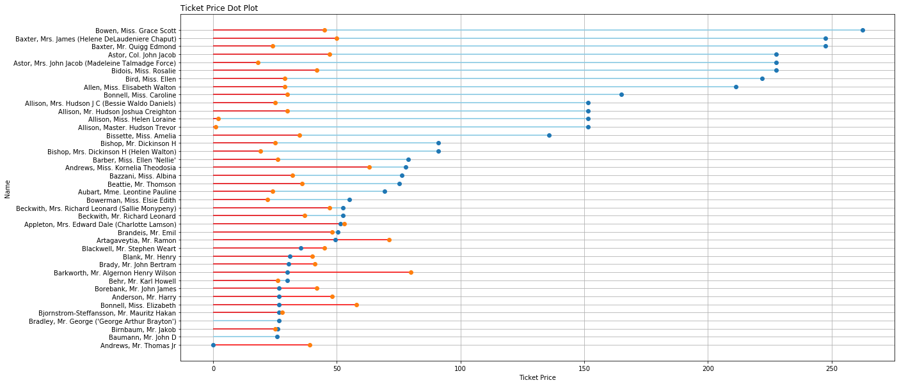

# Cleveland Dot Plots

## Cleveland Dot Plot

##### matplotlib


```python
plt.figure(figsize=(20,10))
plt.hlines(y=my_range, xmin=0, xmax=ordered_df['fare'], color='skyblue')
plt.grid(True)
plt.plot(ordered_df['fare'], my_range, "o")
plt.yticks(my_range, ordered_df['name'])
plt.title("Ticket Price Dot Plot", loc='left')
plt.xlabel('Ticket Price')
plt.ylabel('Name')
```


    Text(0, 0.5, 'Name')





## Multiple Dots
##### matplotlib
Sorting has to be done through dataframe only.


```python
plt.figure(figsize=(20,10))
plt.hlines(y=my_range, xmin=0, xmax=ordered_df['fare'], color='skyblue')
plt.hlines(y=my_range, xmin=0, xmax=ordered_df['age'], color='red')

plt.grid(True)
plt.plot(ordered_df['fare'], my_range, "o")
plt.plot(ordered_df['age'], my_range, "o")

plt.yticks(my_range, ordered_df['name'])
plt.title("Ticket Price Dot Plot", loc='left')
plt.xlabel('Ticket Price')
plt.ylabel('Name')
```


    Text(0, 0.5, 'Name')




