# Other Categorical Plots


## Correlation Plots


```python
plt.figure(figsize= (14,8))
# cmap = cmap=sns.diverging_palette(5, 250, as_cmap=True)
cmap = sns.diverging_palette(250, 10, as_cmap=True)
ax = sns.heatmap(df.corr(),center = 0,annot= True,linewidth=0.5,cmap= cmap)
plt.title('Heatmap for categorical variables in Titanic Dataset', size=15)
```


    Text(0.5, 1, 'Heatmap for categorical variables in Titanic Dataset')


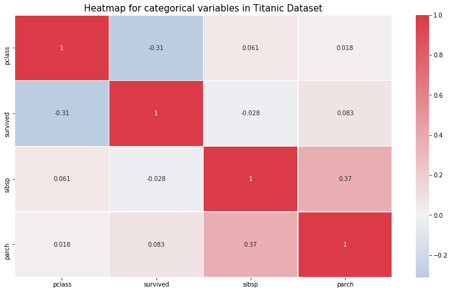


### Symmetric Matrix - hence only showing the lower half


```python
corr = df.corr()
plt.figure(figsize=(14,8))
mask = np.zeros_like(corr)
mask[np.triu_indices_from(mask)] = True
with sns.axes_style("white"):
    ax = sns.heatmap(corr, mask=mask, vmax=.3, square=True,cmap=cmap,center = 0)
plt.title('Heatmap for categorical variables in Titanic Dataset - Partial Matrix', size=15)
```


    Text(0.5, 1, 'Heatmap for categorical variables in Titanic Dataset - Partial Matrix')


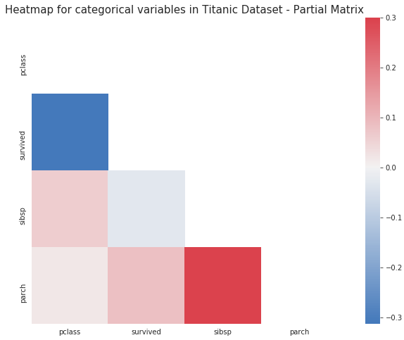


## Barplots for each Categorical Column 


```python
survived_columns = ['pclass', 'survived', 'sibsp', 'parch']
for col in survived_columns:
    val = df[col].value_counts(dropna=False)
    if(len(val.index)>100):
        print("Too many Categories in "+col)
        continue
    #plt.figure(figsize=(7,7))
    sns.barplot(x=val.index,y=val.values,label=True, alpha=0.8)
    plt.title(col)
    plt.ylabel('Count')
    plt.xlabel("Classes")
    plt.grid('True')
    plt.show()
```


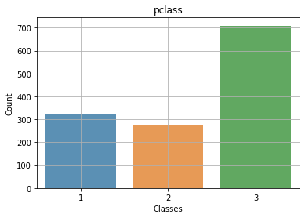


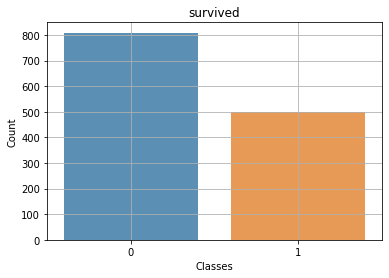


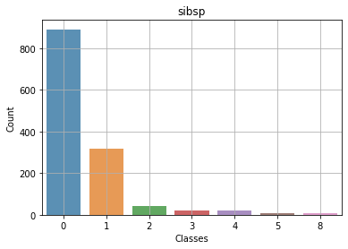


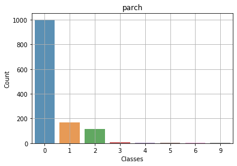


## Circle Charts - Boolean Columns


```python
import itertools
default = df[df["survived"]==1]
non_default = df[df["survived"]==0]

d_cols =['pclass', 'survived', 'sibsp', 'parch']
d_length = len(d_cols)

fig = plt.figure(figsize=(16,4))
for i,j in itertools.zip_longest(d_cols,range(d_length)):
    plt.subplot(1,4,j+1)
    default[i].value_counts().plot.pie(autopct = "%1.0f%%",colors = sns.color_palette("prism"),startangle = 90,
                                        wedgeprops={"linewidth":1,"edgecolor":"white"},shadow =True)
    circ = plt.Circle((0,0),.7,color="white")
    plt.gca().add_artist(circ)
    plt.ylabel("")
    plt.title(i+"-Survivor")


fig = plt.figure(figsize=(16,4))
for i,j in itertools.zip_longest(d_cols,range(d_length)):
    plt.subplot(1,4,j+1)
    non_default[i].value_counts().plot.pie(autopct = "%1.0f%%",colors = sns.color_palette("prism",3),startangle = 90,
                                           wedgeprops={"linewidth":1,"edgecolor":"white"},shadow =True)
    circ = plt.Circle((0,0),.7,color="white")
    plt.gca().add_artist(circ)
    plt.ylabel("")
    plt.title(i+"-Dead")
```


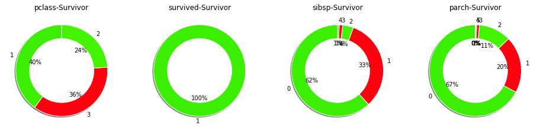


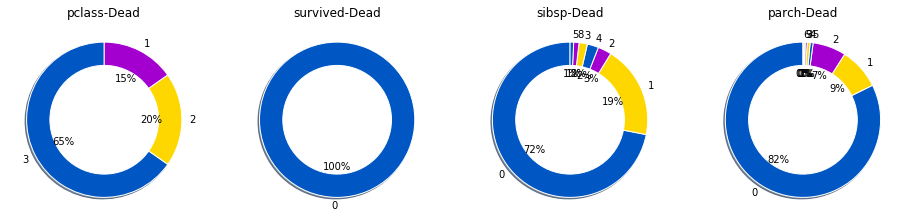


```python
categorical_columns = ['pclass', 'survived', 'sibsp', 'parch']
target = "survived"
```


```python

for col in categorical_columns:
	plt.figure(figsize=(16,8))
	plt.subplot(121)
	df[df[target]==0][col].value_counts().plot.pie(fontsize=9,autopct = "%1.0f%%",colors = sns.color_palette("Set1"),
	wedgeprops={"linewidth":2,"edgecolor":"white"},shadow =True)
	circ = plt.Circle((0,0),.7,color="white")
	plt.gca().add_artist(circ)
	plt.title("Distribution of "+col+" type for target==0",color="b")

	plt.subplot(122)
	df[df[target]==1][col].value_counts().plot.pie(fontsize=9,autopct = "%1.0f%%", colors = sns.color_palette("Set1"),
	wedgeprops={"linewidth":2,"edgecolor":"white"},shadow =True)
	circ = plt.Circle((0,0),.7,color="white")
	plt.gca().add_artist(circ)
	plt.title("Distribution of "+col+" type for target==1",color="b")
	plt.ylabel("")
	plt.show()
```


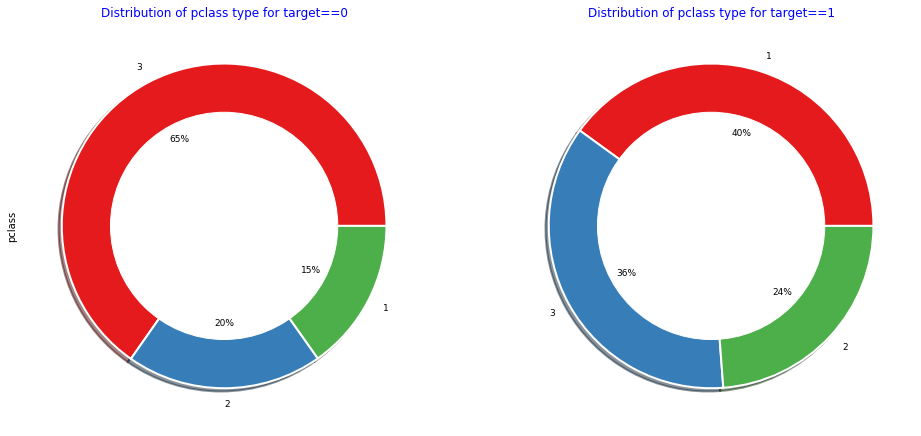


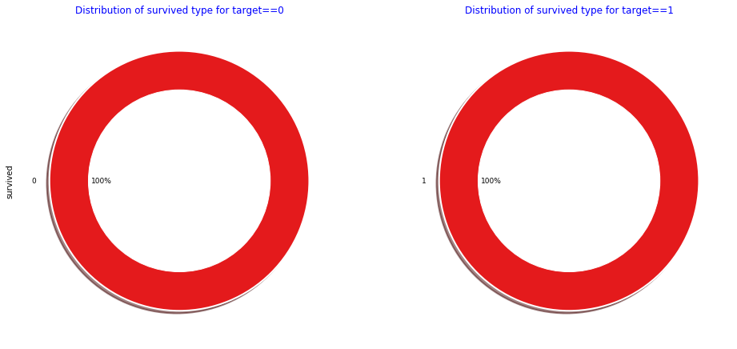


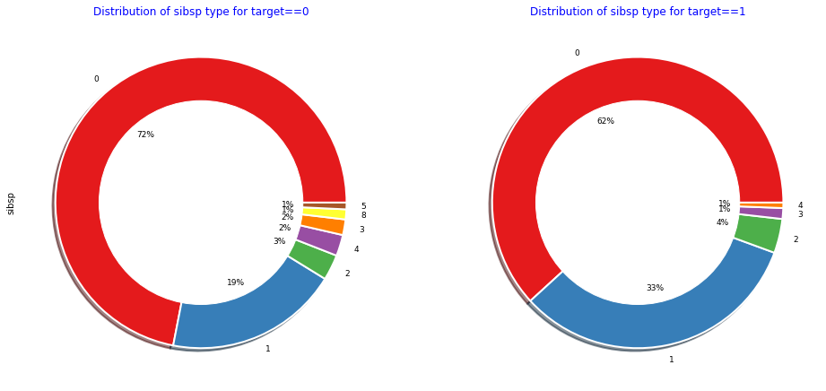


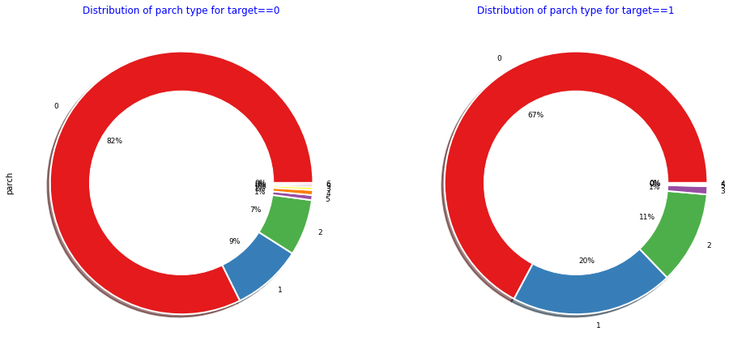


```python

```
