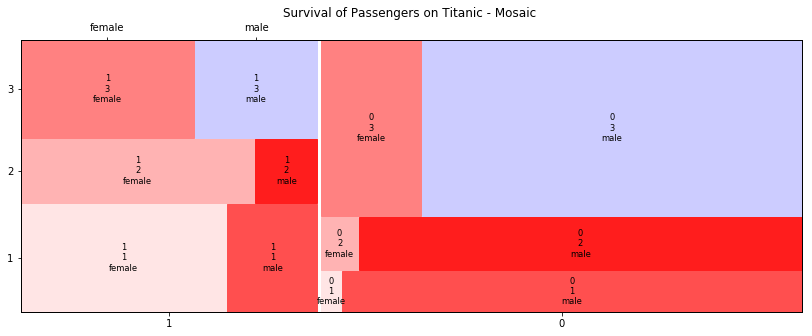

## Mosaic Plots


```python
from statsmodels.graphics.mosaicplot import mosaic
```


```python
def colors(row):
    #print(row)
    survived, pclass, sex = row
    if(survived=='1'):
        if(pclass=='1'):
            if(sex=='male'):
                return {'color':'#e1f5fe'}
            if(sex=='female'):
                return {'color':'#b3e5fc'}
        elif(pclass=='2'):
            if(sex=='male'):
                return {'color':'#81d4fa'}
            if(sex=='female'):
                return {'color':'#4fc3f7'}
        else:
            if(sex=='male'):
                return {'color':'#29b6f6'}
            if(sex=='female'):
                return {'color':'#03a9f4'}
            
    else:
        if(pclass=='1'):
            if(sex=='male'):
                return {'color':'#ffe5e5'}
            if(sex=='female'):
                return {'color':'#ffcccc'}
        elif(pclass=='2'):
            if(sex=='male'):
                return {'color':'#ffb2b2'}
            if(sex=='female'):
                return {'color':'#ff9999'}
        else:
            if(sex=='male'):
                return {'color':'#ff7f7f'}
            if(sex=='female'):
                return {'color':'#ff6666'}
        
```


```python
import matplotlib as mpl
from statsmodels.graphics.mosaicplot import mosaic
mpl.rc("figure", figsize=(14,5))
mosaic(df, ['survived', 'pclass', 'sex'], properties=colors, title='Survival of Passengers on Titanic - Mosaic ')
plt.show()
```




